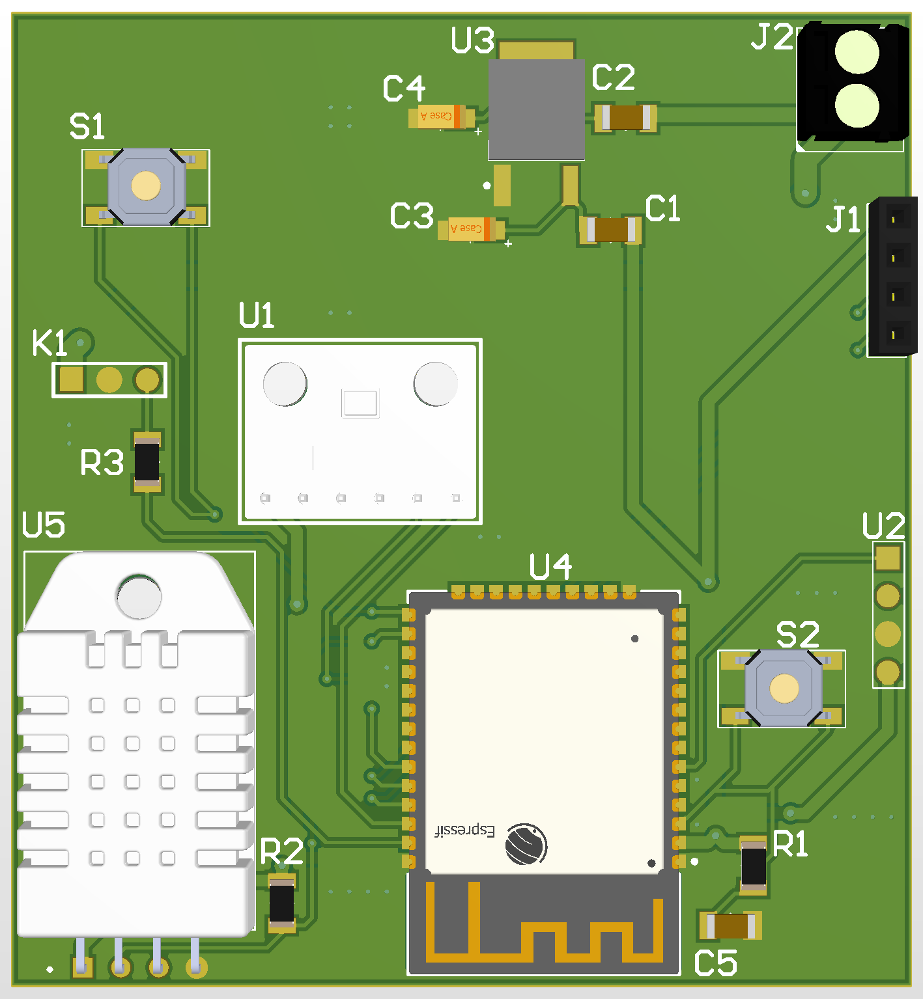

# IoT-Irrigation-System 
ESP32 based automated irrigation system with soil moisture monitoring


#  IoT-Based Automated Irrigation System

This project is a smart, **ESP32-driven IoT solution** designed to optimize water management in agricultural and domestic gardening environments. It leverages real-time sensor data to automate irrigation, ensuring efficient water usage and plant health.

--

##  Key Features
* **Real-time Monitoring:** Continuous tracking of soil moisture levels.
* **Automated Actuation:** Intelligent water pump control based on pre-defined thresholds.
* **Hardware-Software Integration:** Seamless communication between sensors and the ESP32.
* **Power Efficiency:** Designed for long-term deployment with optimized power usage.

--

##  Technical Stack & Components

### **Hardware Architecture**
* **Microcontroller:** ESP32 (Wi-Fi & Bluetooth integrated)
* **Sensors:** Capacitive Soil Moisture Sensor, DHT11 (Temperature & Humidity)
* **Actuators:** 5V/12V Water Pump & Relay Module
* **PCB Design:** **Altium Designer** (Custom Schematic & Layout)

### **Software Stack**
* **Language:** C++ / Arduino Framework
* **Protocols:** MQTT / HTTP
* **IDE:** Arduino IDE / VS Code

--



## 📐 Project Structure
```text
├── src/                # Firmware source code (.ino / .cpp)
├── schematics/         # PCB designs and circuit diagrams (Altium/PDF)
├── docs/               # Project reports and documentation
└── README.md           # Project overview
